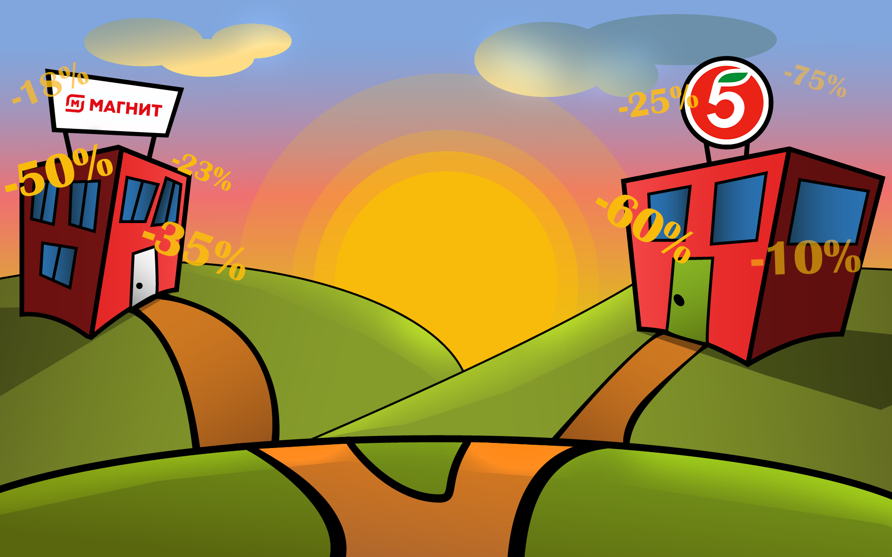

# Hypermarket Price Tracker Bot 🛒💰

**A Telegram bot for finding prices and discounts in "Пятерочка" and "Магнит" hypermarkets.**



## 🌟 Key Features

- Find nearest stores by address or geolocation
- View current prices and discounts in selected stores
- Support ticket system
- Admin panel for user management

## 🛠 Technologies

- **Python** 3.12.3
- **Aiogram** 3 (async Telegram bot framework)
- **PostgreSQL** (database)
- **SQLAlchemy** + **Alembic** (ORM and migrations)
- **HTTPX** (async HTTP requests to store APIs)
- **Geopy** (geocoding and distance calculations)
- **Docker** (containerization)

## 📦 Installation

### Prerequisites
- Docker and Docker Compose
- Python 3.12
- Store API keys (if required)

#### 1. Clone the repository:
```bash
git clone https://github.com/yourusername/hypermarket-price-tracker.git
cd hypermarket-price-tracker
```
#### 2. Create .env.bot file:
```bash
# .env.bot
TOKEN = your_telegram_bot_token
```

#### 3. Run with Docker Compose and local development:
```bash
docker-compose up --build
```
For local development:
```bash
python -m venv venv
source venv/bin/activate  # Linux/Mac
# or venv\Scripts\activate  # Windows

pip install -r requirements.txt
alembic upgrade head
python -m src.main
```

## 🚀 How It Works
1. User starts the bot in Telegram

2. Sends address or geolocation

3. Bot finds nearest stores via hypermarket APIs

4. User selects a store from the list

5. Bot shows current prices and discounts

<!-- SCREENSHOT: Add conversation flow screenshot here -->
### Additional Features:
#### 📩 Support ticket system (stored in separate table)

#### ⚙️ Admin panel:

- Ban/unban users

- Assign admin privileges

- View and process support tickets

## 🗄 Database Structure
### Main tables:

1. users - user information

2. shops - store data

3. products - product information

4. reports - support requests

Migrations are handled via **Alembic**.


# 📞 Contact
### For support or collaboration:

**Email:** rezdomchanel@gmail.com

**Telegram:** @rezdom